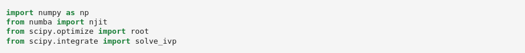

User Guide
----------

The general way to use auto-AUTO (or AUTO²) can be decomposed as follow:

1. Writing the AUTO Fortran and configuration files describing the model to be studied. For this, we refer the user to the |AUTO| manual, although we will provide here an example.
2. Scripting the exploration of the model bifurcation diagrams along different parameters, and representing them on plots.

The second part requires in general the user to have some prerequisite knowledge of dynamical system theory and bifurcation theory.
Along with the |AUTO| manual, these two books might help the user to get acquainted with theses theories:

* Strogatz, S. H. (2024). Nonlinear dynamics and chaos: with applications to physics, biology, chemistry, and engineering. Chapman and Hall/CRC.
* Kuznetsov, Y. A. (1998). Elements of applied bifurcation theory. New York, NY: Springer New York.

Nevertheless, the present User Guide will provide you with a step-by-step detailed example, starting with the |AUTO| setup.

1. Setting up the AUTO model files
==================================

Running a bifurcation analysis of a model with AUTO requires two different configuration files:

1. A Fortran (90) file containing the tendencies of the model, coded as a fortran subroutine. Other procedure might also need to be implemented, depending on the complexity of the problem.
2. A :code:`c.` configuration file, written with a Python-like synthax, and specifying the AUTO parameters of the runs (not to be confused with the model parameters).

In the following, we shall use the celebrated Lorenz 63 (L63) model as an example to details how auto-AUTO works:

.. math::

    \dot x & = \sigma (y-x) \\
    \dot y & = x \rho - y - x z \\
    \dot z & = x y - \beta z

Let's start by defining the Fortran tendencies file. This file should include a subroutine :code:`FUNC`.
Here is such a subroutine for the L63 model:

.. code-block:: fortran

    SUBROUTINE FUNC(NDIM,U,ICP,PAR,IJAC,F,DFDU,DFDP)

    IMPLICIT NONE
    INTEGER, INTENT(IN) :: NDIM, ICP(*), IJAC
    DOUBLE PRECISION, INTENT(IN) :: U(NDIM), PAR(*)
    DOUBLE PRECISION, INTENT(OUT) :: F(NDIM)
    DOUBLE PRECISION, INTENT(INOUT) :: DFDU(NDIM,NDIM), DFDP(NDIM,*)

    DOUBLE PRECISION x, y, z, rho, beta, sigma

    x=U(1)
    y=U(2)
    z=U(3)

    rho=PAR(1)
    beta=PAR(2)
    sigma=PAR(3)

    F(1)= sigma * (y-x)
    F(2)= rho*x - y - x*z
    F(3)= x*y -  beta*z

    END SUBROUTINE FUNC

We see that this subroutine template has several input arguments, but actually only the :code:`U` and :code:`PAR` are used in the code.
The other arguments just correspond to the subroutine :code:`FUNC` signature defined by AUTO, but are not used here.
:code:`U` is the state vector of the model :math:`\vec U = (x,y,z)`, and :code:`PAR` is a parameter vector whose dimension is fixed by AUTO to 36, each component corresponding to a
parameter of the model. Here for example :code:`PAR(1)` is :math:`\rho`, :code:`PAR(2)` is :math:`\beta`, and :code:`PAR(3)` is :math:`\sigma`.

In addition to :code:`FUNC`, other subroutines must be provided:

.. code-block:: fortran

    SUBROUTINE STPNT(NDIM,U,PAR,T)

    IMPLICIT NONE
    INTEGER, INTENT(IN) :: NDIM
    DOUBLE PRECISION, INTENT(INOUT) :: U(NDIM),PAR(*)
    DOUBLE PRECISION, INTENT(IN) :: T

    PAR(1)=0.
    PAR(2)= 8.d0/3.d0
    PAR(3)=10.

    U(1)=0.
    U(2)=0.
    U(3)=0.

    END SUBROUTINE STPNT

    SUBROUTINE BCND
    END SUBROUTINE BCND

    SUBROUTINE ICND
    END SUBROUTINE ICND

    SUBROUTINE FOPT
    END SUBROUTINE FOPT

    SUBROUTINE PVLS
    END SUBROUTINE PVLS

with the most important one being the :code:`STPNT` subroutine which is run before AUTO starts any continuation.
Therefore this routine can be used to specify initial default values for :code:`U` and :code:`PAR` before any AUTO run.
However, in auto-AUTO, these initial default values are usually overridden (more on this below).
The other subroutines are not important in the present case, and we recommend reading the AUTO manual for more information on them.

All of these subroutines must be written in a file, for example here :code:`lrz.f90`.

We can now create a :code:`c.lrz` specifying the default AUTO continuation parameters that we gonna use, and also linking
formally the components of the :code:`U` and :code:`PAR` to symbolic names used by AUTO:

.. code-block:: python

    parnames = {1: 'rho', 2: 'beta', 3: 'sigma', 11: 'T'}
    unames = {1: 'x', 2: 'y', 3: 'z'}
    NDIM=   3, IPS =   1, IRS =   0, ILP =   0
    ICP =  ['rho']
    NTST=  35, NCOL=   4, IAD =   3, ISP =   2, ISW = 1, IPLT= 0, NBC= 0, NINT= 0
    NMX=   50, NPR=  100, MXBF=  10, IID =   2, ITMX= 8, ITNW= 7, NWTN= 3, JAC= 0
    EPSL= 1e-07, EPSU = 1e-07, EPSS =0.0001
    DS  =   0.1, DSMIN=  0.01, DSMAX=   0.5, IADS=   1
    NPAR = 3, THL =  {'T': 0.0}, THU =  {}
    UZSTOP = {'rho': 30.0}

One can see that the syntax here looks like Python scripting, with list and dictionaries being used.
The :code:`parnames` dictionary links the parameters components of the :code:`PAR` vector to parameters names (string), with the keys
of the dictionary being the indices of the vector.
The same applies with the :code:`unames` dictionary, which links the state components of the :code:`U` vector to model variable names (string), with the keys
of the dictionary being the indices of the vector.

The other defined parameters will be used by default by AUTO for each run, although they can be altered during auto-AUTO runs.
We refer the user to the |AUTO| documentation for more information on these parameters. Some information are also available in the present documentation,
in the reference of the :meth:`.FixedPointContinuation.make_continuation` and :meth:`.PeriodicOrbitContinuation.make_continuation`.

2. Scripting using auto-AUTO
============================

Once your AUTO files are finalized, you can turn to creating a Python script or a `Jupyter`_ notebook.
Let's create a Jupyter notebook called :code:`lrz.ipynb`. In general, you will start this script by loading some modules:

.. _Jupyter: https://jupyter.org/

