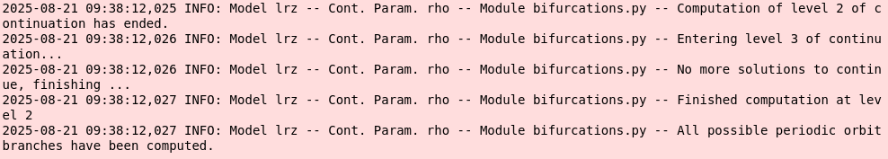
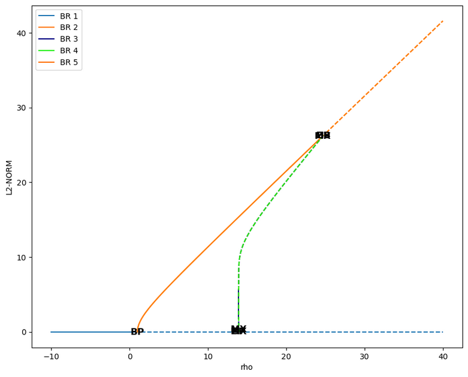
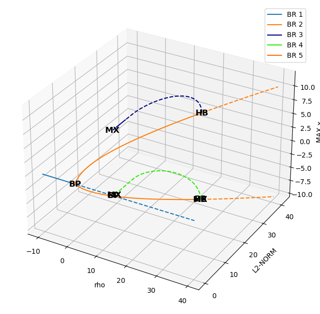
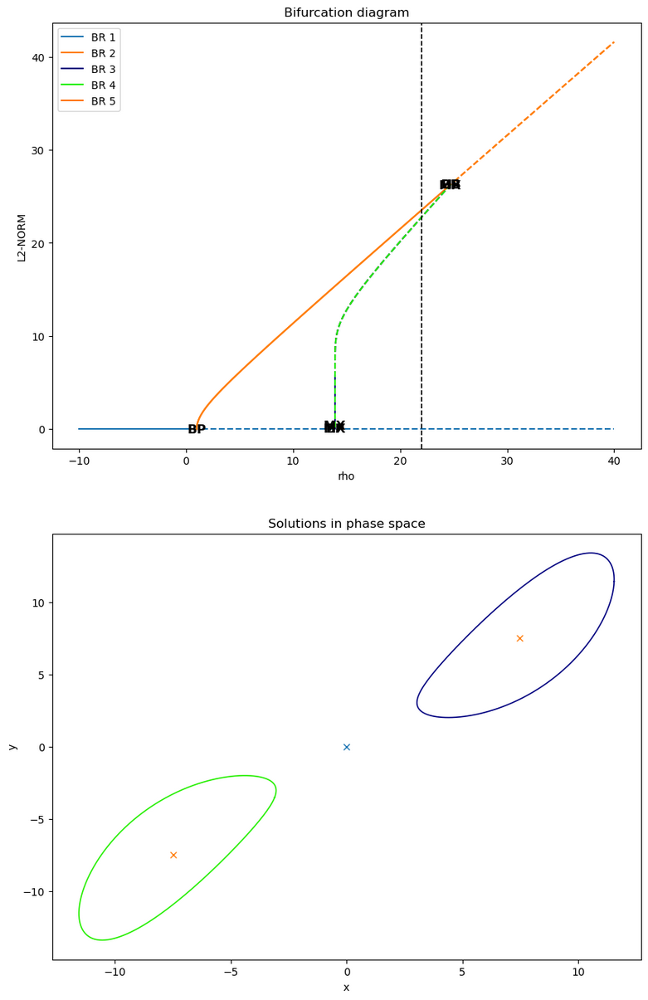
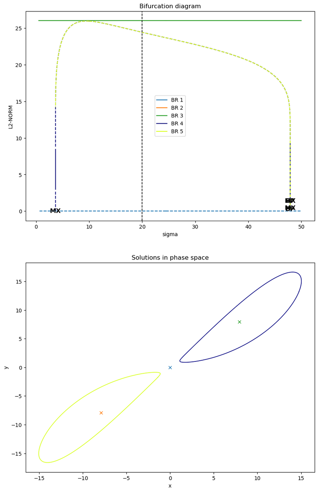

User Guide
----------

The general way to use auto-AUTO (or AUTO²) can be decomposed as follow:

1. Writing the AUTO Fortran and configuration files describing the model to be studied. For this, we refer the user to the |AUTO| manual, although we will provide here an example.
2. Scripting the exploration of the model bifurcation diagrams along different parameters, and representing them on plots.

The second part requires in general the user to have some prerequisite knowledge of dynamical system theory and bifurcation theory.
Along with the |AUTO| manual, these two books might help the user to get acquainted with theses theories:

* Strogatz, S. H. (2024). Nonlinear dynamics and chaos: with applications to physics, biology, chemistry, and engineering. Chapman and Hall/CRC.
* Kuznetsov, Y. A. (1998). Elements of applied bifurcation theory. New York, NY: Springer New York.

Nevertheless, the present User Guide will provide you with a step-by-step detailed example, starting with the |AUTO| setup.

1. Setting up the AUTO model files
==================================

Running a bifurcation analysis of a model with AUTO requires two different configuration files:

1. A Fortran (90) file containing the tendencies of the model, coded as a fortran subroutine. Other procedure might also need to be implemented, depending on the complexity of the problem.
2. A :code:`c.` configuration file, written with a Python-like synthax, and specifying the AUTO parameters of the runs (not to be confused with the model parameters).

In the following, we shall use the celebrated Lorenz 63 (L63) model as an example to details how auto-AUTO works:

.. math::

    \dot x & = \sigma (y-x) \\
    \dot y & = x \rho - y - x z \\
    \dot z & = x y - \beta z

Let's start by defining the Fortran tendencies file. This file should include a subroutine :code:`FUNC`.
Here is such a subroutine for the L63 model:

.. code-block:: fortran

    SUBROUTINE FUNC(NDIM,U,ICP,PAR,IJAC,F,DFDU,DFDP)

    IMPLICIT NONE
    INTEGER, INTENT(IN) :: NDIM, ICP(*), IJAC
    DOUBLE PRECISION, INTENT(IN) :: U(NDIM), PAR(*)
    DOUBLE PRECISION, INTENT(OUT) :: F(NDIM)
    DOUBLE PRECISION, INTENT(INOUT) :: DFDU(NDIM,NDIM), DFDP(NDIM,*)

    DOUBLE PRECISION x, y, z, rho, beta, sigma

    x=U(1)
    y=U(2)
    z=U(3)

    rho=PAR(1)
    beta=PAR(2)
    sigma=PAR(3)

    F(1)= sigma * (y-x)
    F(2)= rho*x - y - x*z
    F(3)= x*y -  beta*z

    END SUBROUTINE FUNC

We see that this subroutine template has several input arguments, but actually only the :code:`U` and :code:`PAR` are used in the code.
The other arguments just correspond to the subroutine :code:`FUNC` signature defined by AUTO, but are not used here.
:code:`U` is the state vector of the model :math:`\vec U = (x,y,z)`, containing the variables defining the *phase space* of the system.
:code:`PAR` is a parameter vector whose dimension is fixed by AUTO to 36, each component corresponding to a
parameter of the model. Here for example :code:`PAR(1)` is :math:`\rho`, :code:`PAR(2)` is :math:`\beta`, and :code:`PAR(3)` is :math:`\sigma`.

In addition to :code:`FUNC`, other subroutines must be provided:

.. code-block:: fortran

    SUBROUTINE STPNT(NDIM,U,PAR,T)

    IMPLICIT NONE
    INTEGER, INTENT(IN) :: NDIM
    DOUBLE PRECISION, INTENT(INOUT) :: U(NDIM),PAR(*)
    DOUBLE PRECISION, INTENT(IN) :: T

    PAR(1)=0.
    PAR(2)= 8.d0/3.d0
    PAR(3)=10.

    U(1)=0.
    U(2)=0.
    U(3)=0.

    END SUBROUTINE STPNT

    SUBROUTINE BCND
    END SUBROUTINE BCND

    SUBROUTINE ICND
    END SUBROUTINE ICND

    SUBROUTINE FOPT
    END SUBROUTINE FOPT

    SUBROUTINE PVLS
    END SUBROUTINE PVLS

with the most important one being the :code:`STPNT` subroutine which is run before AUTO starts any continuation.
Therefore this routine can be used to specify initial default values for :code:`U` and :code:`PAR` before any AUTO run.
However, in auto-AUTO, these initial default values are usually overridden (more on this below).
The other subroutines are not important in the present case, and we recommend reading the AUTO manual for more information on them.

All of these subroutines must be written in a file, for example here :code:`lrz.f90`.

We can now create a :code:`c.lrz` specifying the default AUTO continuation parameters that we gonna use, and also linking
formally the components of the :code:`U` and :code:`PAR` to symbolic names used by AUTO:

.. code-block:: python

    parnames = {1: 'rho', 2: 'beta', 3: 'sigma', 11: 'T'}
    unames = {1: 'x', 2: 'y', 3: 'z'}
    NDIM=   3, IPS =   1, IRS =   0, ILP =   0
    ICP =  ['rho']
    NTST=  35, NCOL=   4, IAD =   3, ISP =   2, ISW = 1, IPLT= 0, NBC= 0, NINT= 0
    NMX=   50, NPR=  100, MXBF=  10, IID =   2, ITMX= 8, ITNW= 7, NWTN= 3, JAC= 0
    EPSL= 1e-07, EPSU = 1e-07, EPSS =0.0001
    DS  =   0.1, DSMIN=  0.01, DSMAX=   0.5, IADS=   1
    NPAR = 3, THL =  {'T': 0.0}, THU =  {}
    UZSTOP = {'rho': 30.0}

One can see that the syntax here looks like Python scripting, with list and dictionaries being used.
The :code:`parnames` dictionary links the parameters components of the :code:`PAR` vector to parameters names (string), with the keys
of the dictionary being the indices of the vector.
The same applies with the :code:`unames` dictionary, which links the state components of the :code:`U` vector to model variable names (string), with the keys
of the dictionary being the indices of the vector.

The other defined parameters will be used by default by AUTO for each run, although they can be altered during auto-AUTO runs.
We refer the user to the |AUTO| documentation for more information on these parameters. Some information are also available in the present documentation,
in the reference of the :meth:`.FixedPointContinuation.make_continuation` and :meth:`.PeriodicOrbitContinuation.make_continuation`.

2. Scripting using auto-AUTO
============================

Once your AUTO files are finalized, you can turn to creating a Python script or a `Jupyter`_ notebook.
In general, you will start this script by loading some modules:

.. code-block:: python

    import numpy as np
    from numba import njit
    from scipy.optimize import root

that will be useful later, and then load the :class:`.BifurcationDiagram` class:

.. code-block:: python

    from auto2.diagrams.bifurcations import BifurcationDiagram

2.1 Finding initial solutions of the model
~~~~~~~~~~~~~~~~~~~~~~~~~~~~~~~~~~~~~~~~~~

Computing a bifurcation diagram requires continuing solutions along a given parameter, but one needs solutions to start from at a given value of the
said parameter. One can start from periodic orbit solutions, but the usual way is to start from a list of fixed (stationary) points.

In our present example, they are the solutions of the equations:

.. math::

    \dot x & = \sigma (y-x) = 0 \\
    \dot y & = x \rho - y - x z = 0 \\
    \dot z & = x y - \beta z = 0

i.e. the points :math:`(x_i,y_i,z_i)` where the tendencies :math:`(\dot x, \dot y, \dot z)` are zero.
In the case of the L63 model, one could easily compute these solutions analytically, but here, for
the sake of generality, we shall compute them numerically. For that we first need to code the tendencies equations:

.. code-block:: python

    @njit
    def lrz(X, rho, beta, sigma):
        x = X[0]
        y = X[1]
        z = X[2]
        F = np.zeros(3)
        F[0] = sigma * (y - x)
        F[1] = rho * x - y - x * z
        F[2] = x * y - beta * z
        return F

where we are using `Numba`_ to accelerate our code.
In the following, we are going to compute the bifurcation diagram along :math:`\rho`, with the other parameters
set to :math:`\sigma=10` and :math:`\beta=8/3`.
We are thus going first to find the fixed points for the values :math:`\rho=0`, :math:`\sigma=10` and :math:`\beta=8/3`
using a `root-finding algorithm`_ provided by `Scipy`_:

.. code-block:: python

    # parameters dictionary
    params = {
        'rho': 0.,
        'beta': 8./3,
        'sigma': 10.,
    }

    # number of search to finds the root of the equations
    nsearch = 1000

    # start on nsearch random initial conditions
    ic = 2 * (np.random.rand(nsearch, 3) - 0.5) * 10.

    # tolerance for the equalities between found solutions
    eps = 1.e-6

    # dictionary to hold to found solutions
    fixed_points = dict()

    # solutions search loop
    sol_idx = 1
    for i in range(nsearch):
        # trying to find a new solution
        sol = root(lrz, ic[i, :], args=tuple(params.values()))
        if sol.success:
            # if we found a solution, check if we already found it before
            for idx in fixed_points:
                if np.linalg.norm(fixed_points[idx] - sol.x) < eps:
                    break
            else:
                # if not, store the new solution
                fixed_points[sol_idx] = sol.x
                sol_idx+=1

Applying this algorithm for the value of the parameters above actually give only one solution in this case:

.. image:: figures/found_points.png

2.2 Computing the bifurcation diagram of fixed points using auto-AUTO
~~~~~~~~~~~~~~~~~~~~~~~~~~~~~~~~~~~~~~~~~~~~~~~~~~~~~~~~~~~~~~~~~~~~~

Once we have these fixed points, we can provide them to auto-AUTO to start the computation of the bifurcation diagram along :math:`\rho`.
But first we need to create a :class:`.BifurcationDiagram` object:

.. code-block:: python

    b = BifurcationDiagram('lrz')

providing it the name of the model (related to the files :code:`c.lrz` and :code:`lrz.f90`) that we want to use.
Once this is done, we can use the :meth:`.compute_fixed_points_diagram` method of this object to start the computation
of the fixed points continuation.
Reading the documentation of this method, you will see that you need to prepare the list of fixed points in specific manner:

.. code-block:: python

    initial_points = list()

    for p in fixed_points:
        initial_points.append({'parameters': params, 'initial_data': fixed_points[p]})

where :code:`params` is the parameters dictionary defined previously. Once this list have been prepared, you can now start the computation:

.. code-block:: python

    b.compute_fixed_points_diagram(initial_points,
                                   extra_comparison_parameters=['x', 'y'],
                                   comparison_tol=[1.e-1] * 3,
                                   ICP=['rho'],
                                   NMX=300,
                                   UZSTOP={'rho':[-10.,40.]},
                                   UZR={'rho': list(np.arange(2, 30, 2.5))},
                                   NPR=0)

In addition to the list of initial points, the provided argument can be described as follow:

* :code:`extra_comparison_parameters`: This argument allows for a finer control of the equalities between solutions.
  Indeed, auto-AUTO will try to compare the solutions found during the continuation to other solutions
  that have already been computed. To do so, it will compare by default the value of the continuation parameter (:math:`\rho` here)
  of the solutions. The :code:`extra_comparison_parameters` argument can be used to specify additional
  variables to compare. Any variable that is tracked during the continuation can be used (for example the :math:`L_2` norm is always tracked).
  Here for instance, we require that the :math:`x` and :math:`y` phase space variables be also compared.
* :code:`comparison_tol`: Allow to specify the tolerance of the equalities between solutions.
  Can be a number, which then applies for any variable being compared (see :code:`extra_comparison_parameters` just above).
  Can be also a list of numbers, in which case its length must be :code:`len(extra_comparison_parameters)` + 1, the first number being used to compare
  the continuation parameter, and subsequent ones being used to compare the variable specified by :code:`extra_comparison_parameters` argument.
* :code:`ICP`: This is an argument that is passed to AUTO to specify the continuation parameter.
* :code:`NMX`: This is an argument that is passed to AUTO to specify after how much continuation steps the continuations must end. This is a hard limit
  being put on the AUTO computations, however the computations might end before due to other conditions. In auto-AUTO, since the comparison and logic are
  applied after AUTO runs have finished, this is an useful option to limit the scope and the length of the computations.
  On the other hand, setting NMX to low might result in an incomplete bifurcation diagram. Maximum value is 9999.
* :code:`UZSTOP`: This is an argument that is passed to AUTO to specify continuations' stopping conditions, in the form of parameters bounds.
* :code:`UZR`: This is an argument that is passed to AUTO to specify user defined solution points, for which AUTO will store the full solution data.
  A list of value can be provided for each continuation parameter.
* :code:`NPR`: This is an argument that is passed to AUTO to specify the output behavior in the temporary :code:`fort.8` file. Not very important here.

Running this code will result in the text outputs detailing the processed continuation of the provided solutions. Once it finished, the user can plot the
results:

.. code-block:: python

    b.plot_fixed_points_diagram()

which will show that there are two branches of fixed point solutions here:

.. image:: figures/fixed_points.png

The first one (in blue above) emanates from the fixed point (0,0,0) that we had previously found. The second one was found automatically by AUTO though
a branching point at :math:`\rho=1` and auto-AUTO made a second AUTO run to switch branch and compute this new one (in orange above).
Interestingly, AUTO detected additional bifurcation points in the orange branch, namely `Hopf bifurcations`_ which are known to give birth periodic orbits.

2.3 Computing the bifurcation diagram of periodic orbits using auto-AUTO
~~~~~~~~~~~~~~~~~~~~~~~~~~~~~~~~~~~~~~~~~~~~~~~~~~~~~~~~~~~~~~~~~~~~~~~~

The computation of the periodic orbits emanating from the Hopf bifurcations found along the continuations of the fixed points can be processed automatically
by auto-AUTO. To do so, one must use the :meth:`.compute_periodic_orbits_diagram` method of the :class:`BifurcationDiagram` object were the fixed points
bifurcation diagram has already been computed:

.. code-block:: python

    b.compute_periodic_orbits_diagram(
        end_level=3,
        extra_comparison_parameters=['x', 'y'],
        max_number_bp=None,
        comparison_tol=[1.e-3, 1.e-3, 1.e-3],
        ICP=['rho']
    )

where all the arguments have been described in the previous section, except :code:`end_level`, which specifies the maximum level that auto-AUTO can reach in the bifurcation tree.
Indeed, bifurcation diagram can be seen as tree of parents and offspring solutions. auto-AUTO computes all the solutions at a given level and then is presented with the opportunity
to stop at that level. The :code:`end_level` is thus a stopping condition that ensures that the computations stops at a given level (bifurcation tree can be infinite).

In the present case, the bifurcation tree stops at the second level. The messages provided by auto-AUTO indicate that no new bifurcation points were found:

and the stopping condition :code:`end_level=3` that we provided was a bit superfluous.

.. note::

    Note also that the arguments provided to the method :meth:`compute_fixed_points_diagram` call above and not modified when calling :meth:`compute_periodic_orbits_diagram`
    are reused by this latter call. It means for example that the computation of the periodic orbits above was done with the AUTO parameters
    :code:`NMX=300, UZSTOP={'rho':[-10.,40.]}, UZR={'rho': list(np.arange(2, 30, 2.5))}, NPR=0`.

Now that we have computed both bifurcation diagrams (fixed points and periodic orbits), we can plot on the same figure the results:

.. code-block::

    ax = b.plot_fixed_points_diagram()
    b.plot_periodic_orbits_diagram(ax=ax, cmap='gist_ncar')

were we use the property that every plotting function in auto-AUTO returns the |Matplotlib| axis on which the plotting was done.
Note also that to plot the periodic orbits branches, we use a color schemes based on the :code:`cmap` parameter. This is done
to better differentiate the plotting of the fixed points branches (which uses the Tableau color) and the periodic orbits branches.

Here is the result:

where we can see that three new (periodic orbits) branches have appeared. The last one is not important here (spurious result ?), but the branches 3 and 4 are interesting.
They emanate from the Hopf bifurcations and their :math:`L_2` norm then tend to zero, i.e. the same value as the fixed point at the origin of the phase space.
On this plot of :math:`\rho` versus the :math:`L_2` norm, they look similar, but actually a 3D plot involving the :math:`x` phase space variable shows that they are not to be confused:

.. code-block::

    ax = b.plot_fixed_points_diagram_3D()
    b.plot_periodic_orbits_diagram_3D(ax=ax, cmap='gist_ncar')

What we have seen so far are plots of the branches of solutions as a function of the continuation parameter, but it would be interesting to see the solutions
embedded in the phase space where they live. To do that, one can use the :meth:`.plot_diagram_and_solutions`:

.. code-block:: python

    b.plot_diagram_and_solutions(solutions_parameter_value=22., solutions_variables=(0, 1), fixed_points_diagram_kwargs={'legend': True},
                             periodic_orbits_diagram_kwargs={'cmap': 'gist_ncar'});

This method will plot the bifurcation diagram in 2D as before, and its (mandatory) :code:`solutions_parameter_value` argument is used to determine the value of the continuation parameter
for which the solutions will be plotted a 2D section of the phase space on another plot:

Here we see that the value :math:`\rho=22` has been provided, resulting in a dashed vertical black line on the bifurcation diagram, and fixed points (crosses) and periodic orbits (solid curves)
of the same color as the corresponding branches appears in the phase space plot below.

.. note::

    For these solutions to appear in the phase space, they must have been computed and stored in the first place.
    Here, the value :math:`\rho=22` appears in the :code:`UZR={'rho': list(np.arange(2, 30, 2.5))}` list provided initially to
    auto-AUTO. Because of this, along any continuation, at :math:`\rho=22` a solution point is saved, and it can be picked up
    by auto-AUTO to draw it in the phase space plot. If this value is not present in the :code:`UZR` argument, no solution would
    appear in the phase space plot.

So, this method is powerful to plot solutions at a given value of the continuation parameter, but what if we want to show the
evolution of the solutions along a particular branch. For this, auto-AUTO provides the :meth:`.plot_single_po_branch_and_solutions` method,
to which we must provide the number of the branch that we want to plot:

.. code-block:: python

    # plotting branch 3
    b.plot_single_po_branch_and_solutions(3, cmap='Blues_r')

It results into a plot of all the periodic orbits of the selected branches:

.. image:: figures/branch_solutions_plot.png

where the user defined solution points are shown by colored dots on the bifurcation diagram, and the solutions corresponding to those dots are plotted on the phase space plot with
the same color as the dots. The colors being used are specified by the :code:`cmap` argument.
These plots are interesting because we see that branch 3 emanating initially from a Hopf bifurcation is - as :math:`\rho` decreases - getting closer and closer to an orbit connecting
the fixed point at the origin with itself. This periodic orbit is thus finally identifying with an *homoclinic orbit*, a point sometimes called an *homoclinic bifurcation* which can lead to
chaotic behaviors in dynamical systems.

See Barrio et al. (2012) and references therein for more information about these phenomena:

* Barrio, R., Shilnikov, A., & Shilnikov, L. (2012). Kneadings, symbolic dynamics and painting Lorenz chaos.
  *International Journal of Bifurcation and Chaos*, **22** (04), 1230016. `doi:10.1142/S0218127412300169 <https://doi.org/10.1142/S0218127412300169>`_.

2.4 Changing the continuation parameter and restarting
~~~~~~~~~~~~~~~~~~~~~~~~~~~~~~~~~~~~~~~~~~~~~~~~~~~~~~

Finally, once you have computed the bifurcation diagram along :math:`\rho`, you might want to compute it also along other parameters.
To do this, you could restart the whole procedure detailed in sections 2.1, 2.2 and 2.3, just changing the continuation parameter.
However, auto-AUTO also provide another possibility: starting this new bifurcation diagram from all the solutions already found
for a given value of the continuation parameter of an already existing bifurcation diagram.

For example, here, we are going to start a new bifurcation diagram along the parameter :math:`\sigma` from all the solutions found previously
at :math:`\rho=24.5`. This is very easy to do in auto-AUTO thanks to the :meth:`.restart_and_change_continuation_parameters` method:

.. code-block:: python

    # for the sake of clarity, putting the parameters that we will provide
    # to AUTO for this new bifurcation diagram in a dictionary
    continuation_kwargs = {'ICP':['sigma'],
                           'NMX': 300,
                           'UZSTOP': {'sigma':[0.5,50.]},
                           'UZR': {'sigma': [3.67, 3.7]+list(np.arange(2.5, 45., 2.5))}}

    # starting a new bifurcation diagram from the existing b object
    new_b = b.restart_and_change_continuation_parameters(value=24.5,
                                                         end_level=2,
                                                         extra_comparison_parameters=['x', 'y'],
                                                         comparison_tol=[1.e-1] * 3,
                                                         fixed_points_continuation_kwargs=continuation_kwargs,
                                                         periodic_orbits_continuation_kwargs=continuation_kwargs)

This create a new bifurcation diagram object and perform automatically all the required continuations for you.
Changing the continuation parameter is often interesting when studying the dynamics of systems, as it gives
more insight into what's happening and allows sometimes one to find new structures.

Now the results can be plotted again:

.. code-block:: python

    new_b.plot_diagram_and_solutions(20., solutions_variables=(0, 1), fixed_points_diagram_kwargs={'legend': True},
                                    periodic_orbits_diagram_kwargs={'cmap': 'gist_ncar'})

First, we can see from these plot that the three points (branches BR 1, BR 2 and BR 3) do not change when :math:`\sigma` is varied.
Then, as for the bifurcation diagram along :math:`\rho`, the two periodic orbits (BR 4 and BR 5) connect to the fixed point at
the origin of the phase space, with for each orbit two
different homoclinic bifurcations taking place, one close to :math:`\sigma\approx 3`, and the other close to :math:`\sigma\approx 48`.
This can actually easily be seen by plotting the solutions of
one of the two branches in 3D with the :meth:`.plot_single_po_branch_and_solutions_3D` method:

.. code-block:: python

    new_b.plot_single_po_branch_and_solutions_3D(4, cmap='coolwarm')

.. image:: figures/branch_solutions_plot_3D_sigma.png

This is consistent with the regime diagram shown in Figure 3 of Barrio et al. (2012) (see above).

.. note::

    A regime diagram is a bifurcation diagram showing the evolution of bifurcation points along two continuation parameters.
    This kind of diagram can also possess new kind of bifurcations, called co-dimension 2 bifurcations
    (see the books proposed at the beginning of this userguide for more information).
    Regime diagram generation is not yet supported by auto-AUTO, but is mentioned on the wishlist for future developments.

.. note::

    A Jupyter notebook with the code of this User Guide is available in the :code:`./notebooks/auto-demos/lrz` folder of
    the auto-AUTO code repository. Many other examples are available in the :code:`./notebooks` folder.

.. _Jupyter: https://jupyter.org/
.. _Numba: https://numba.pydata.org/
.. _Scipy: https://scipy.org/
.. _Hopf bifurcations: http://www.scholarpedia.org/article/Andronov-Hopf_bifurcation
.. _root-finding algorithm: https://docs.scipy.org/doc/scipy/reference/generated/scipy.optimize.root.html
